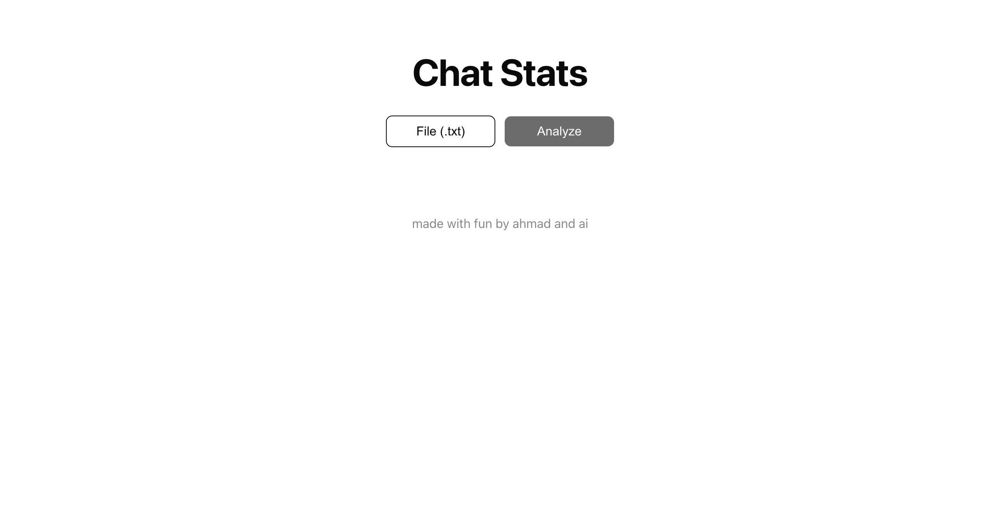
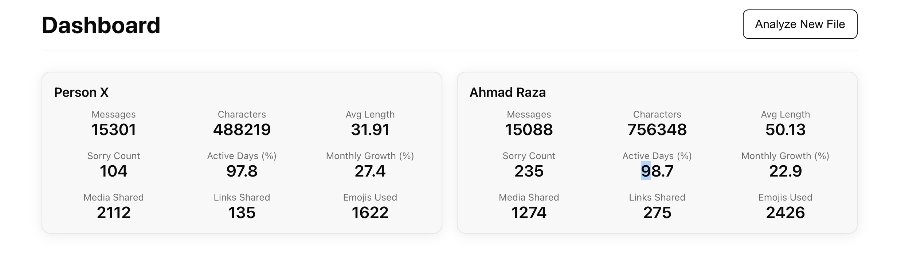
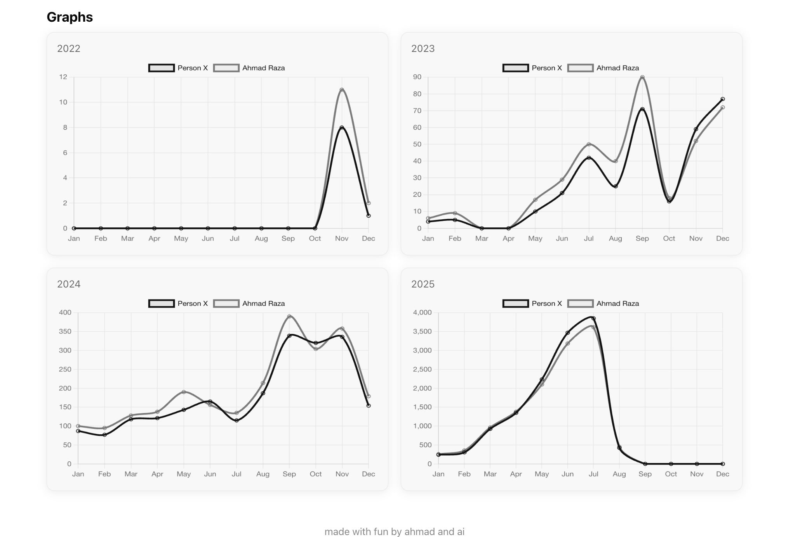

# chattrix

analyze your whatsapp chats in seconds. upload your exported chat file and get instant stats, trends, and insights. 





## features
- super fast chat analysis
- vibe check: see who’s most active
- emoji stats & word trends
- clean, minimal ui

## how to use
1. export your whatsapp chat (txt format)
2. upload it on chattrix
3. get your stats. flex your chat game

## tech
- flask
- javascript
- html/css

## made for us
no boring stuff. just vibes.

## run locally
```bash
pip install -r requirements.txt
python app.py
```

ps: coded while getting bored on bed due to illness.
